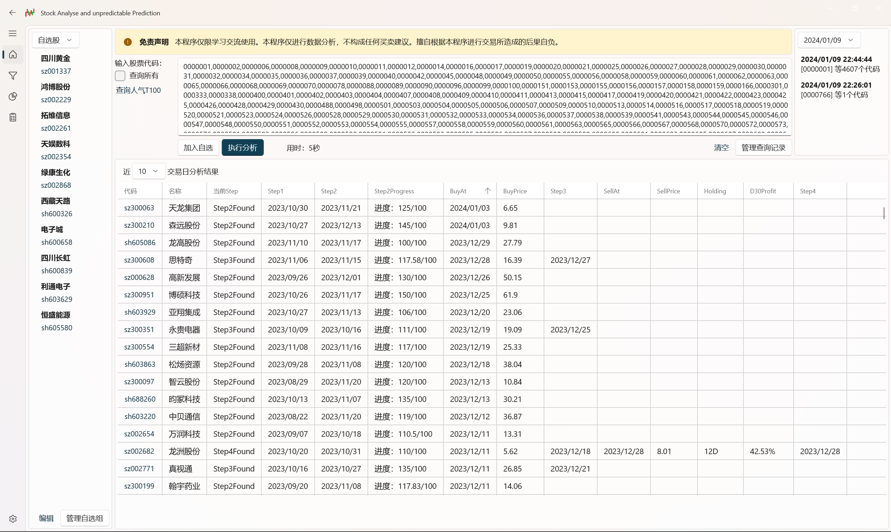
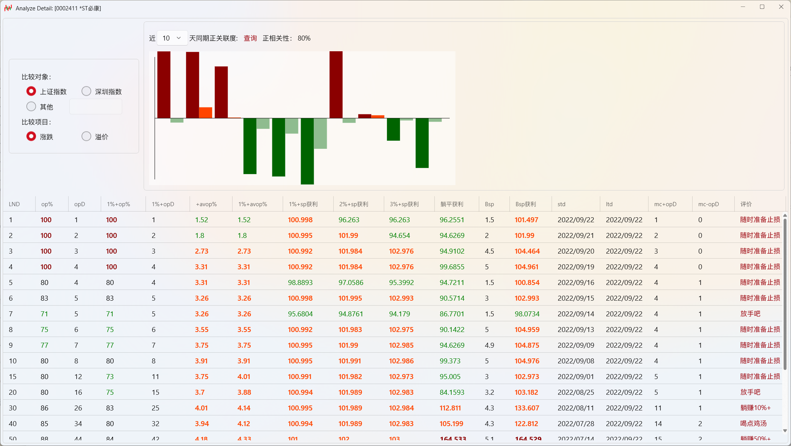
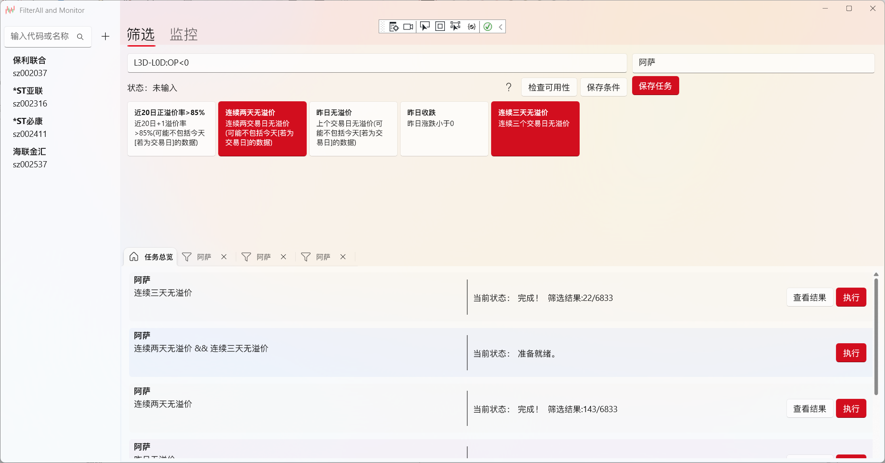
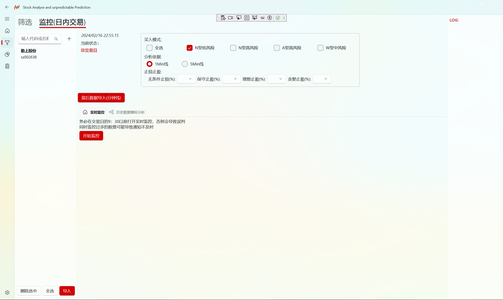

# SAaP

This is a WinUI3 Project related to simple analysis of Chinese A stock market. Use it at your own discretion.

  - 🚨 Ensure you have Win10/Win11 10.0.17763.0 or a compatible version before proceeding.

# ⚠ Serious Warning ⚠ 

In the face of fundamentals and major trends, technical indicators are utterly futile :)

## Usage

- Install Visual Studio Community
- Build
- F5
- Deal with error

## references

- Python
- TDX
- Requires .NET 6.0 or above

# Screenshot

