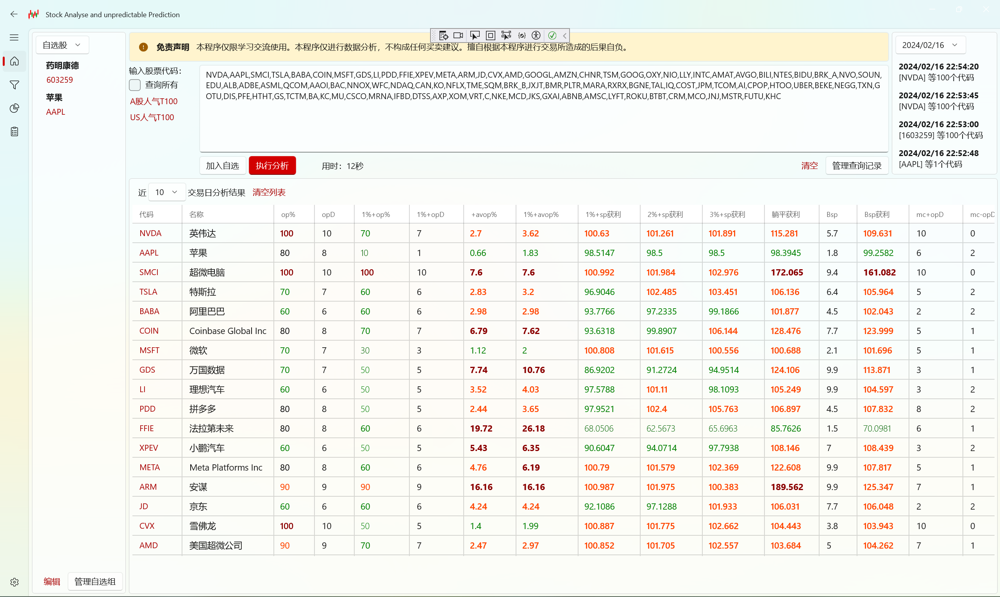
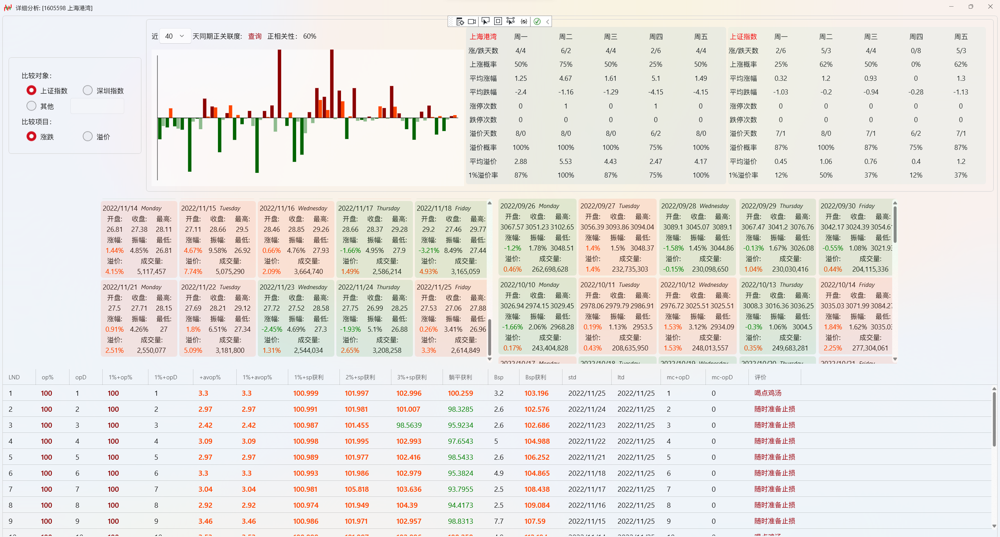
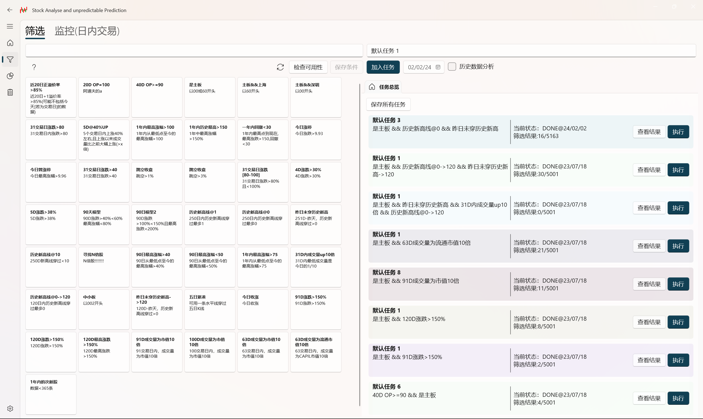

# SAaP

This is a WinUI3 Project related to simple analysis of Chinese A stock market && US stock. Use it at your own discretion.

- 🚨 Ensure you have Win10/Win11 10.0.17763.0 or a compatible version before proceeding.

## ⚠ Serious Warning ⚠

In the face of fundamentals and major trends, technical indicators are utterly futile :)

## Installation

Install from the Microsoft Store:

Or build from the source code:

- Install Visual Studio Community
- Build
- F5

## References

- Python
- TDX
- Requires .NET 6.0 or above

## Screenshot

